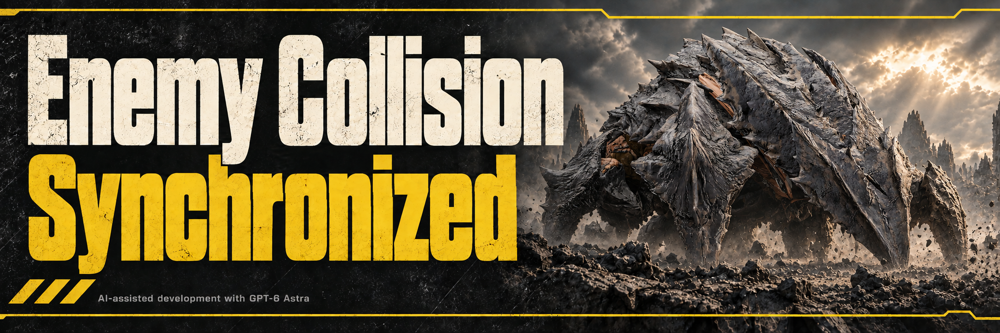

> Current local compatibility candidate for Steam build 25480438 / EXE 1.8.46015.0. Offline checks passed; live gameplay verification is pending.

# Enemy Collision Synchronized

Keeps large enemy corpse collisions aligned with their bodies and curbs the renewed ragdoll movement that can occur in vanilla.

- **Fewer invisible obstructions.** Realigns displaced collision pieces on settled corpses so their blocking surfaces better match the visible body.
- **Calmer settled bodies.** Detects substantial renewed movement after a remote corpse has settled and stops its ongoing ragdoll synchronization.
- **Cleaner Impaler remains.** Disables the lingering collision on settled Impaler tentacle claws.
- **Coverage across factions.** Includes compatible large Terminid, Automaton and Illuminate enemies, including Bile Titans, Impalers, walkers and tripods.

Corpse bodies retain their normal physical collision. The changes run on your game client; install with Bingus Shared Loader, or use Vanilla Plus Megapack with the loader.

Local build: **v2.9** with reduced inspection overhead and expanded performance diagnostics. [Published v2.7](https://github.com/CowboyBingus/EnemyCollisionSynchronized/releases/tag/v2.7) · [Install](INSTALL.txt) · [Build](CONTRIBUTING.md) · [Changelog](docs/RELEASE_NOTES.md) · [Performance profiling](docs/PERFORMANCE.md)

Download [Bingus Shared Loader v17 or newer](https://github.com/CowboyBingus/BingusSharedLoader/releases/latest) from its own repository. Enable the loader alongside this mod, or alongside Vanilla Plus Megapack.

Current version: **v2.10.2**, for game build **25480438**. See [changes](CHANGELOG.md) and [validation coverage](docs/MIGRATION_VALIDATION.md).
